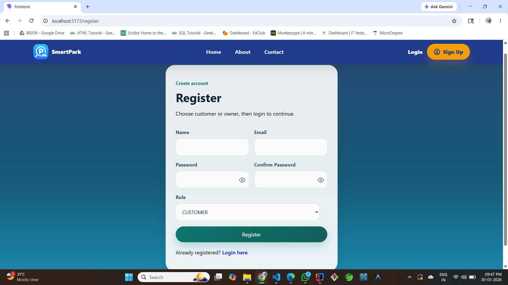
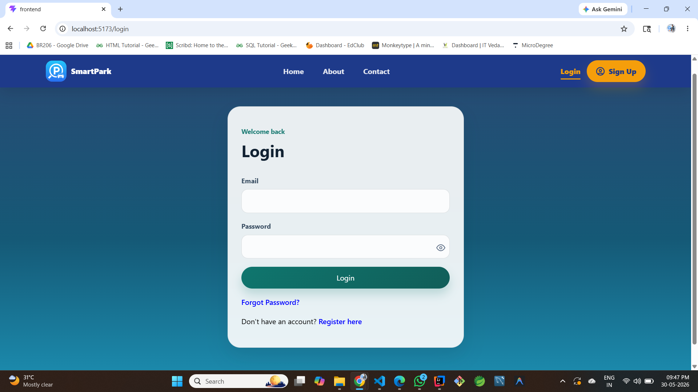
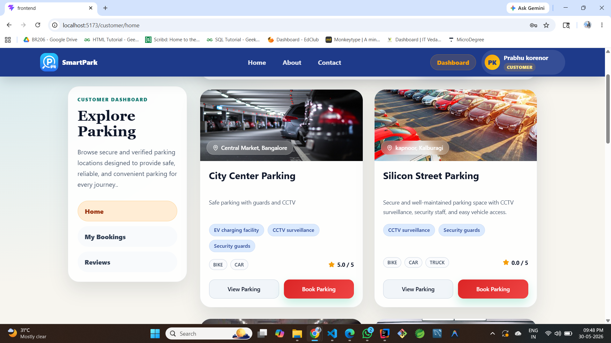
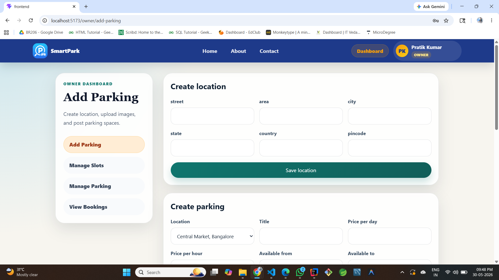
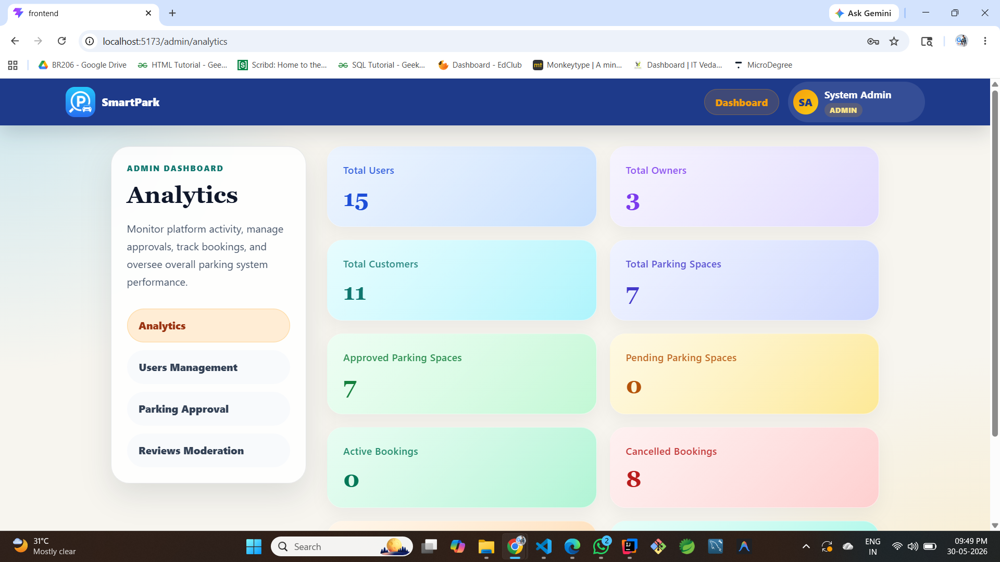

# 🚗 Parking Management System

A Full-Stack Parking Management System designed to streamline parking operations by enabling users to book parking slots, owners to manage parking spaces, and administrators to oversee the entire system through role-based dashboards.

---

## 📖 Project Overview

The Parking Management System is a web-based application that provides an efficient solution for managing parking spaces. The system supports multiple user roles including Users, Parking Owners, and Administrators, each with dedicated functionalities and dashboards.

The application simplifies parking management by allowing users to register, log in, search for available parking spaces, make bookings, and manage parking activities through an intuitive interface.

---

## ✨ Key Features

### 👤 User Module

* User Registration and Login
* View Available Parking Spaces
* Book Parking Slots
* Manage Personal Bookings
* Track Parking Status

### 🏢 Owner Module

* Owner Registration and Authentication
* Add and Manage Parking Spaces
* Monitor Parking Occupancy
* View Booking Information
* Manage Parking Availability

### 🔐 Admin Module

* Manage Users and Owners
* Monitor Parking Activities
* View System Statistics
* Manage Parking Records
* Complete System Control

### 🛡️ Security Features

* Secure Authentication
* Role-Based Access Control
* Protected API Endpoints
* Data Validation

---

## 🛠️ Tech Stack

### Frontend

* React.js
* HTML5
* CSS3
* JavaScript

### Backend

* Java
* Spring Boot
* REST APIs

### Database

* MySQL

### Tools & Technologies

* Git
* GitHub
* Maven
* VS Code
* Eclipse

---

## 🏗️ System Architecture

```text
Frontend (React.js)
        │
        ▼
REST APIs (Spring Boot)
        │
        ▼
     MySQL
```

---

## 📂 Project Structure

```text
FINAL_PMS/
│
├── backend/
│   ├── src/
│   ├── pom.xml
│   └── target/
│
├── frontend/
│   ├── src/
│   ├── public/
│   └── package.json
│
├── uploads/
│
├── screenshots/
│   ├── register.png
│   ├── login.png
│   ├── user-dashboard.png
│   ├── owner-dashboard.png
│   └── admin-dashboard.png
│
└── README.md
```

---

## 📸 Application Workflow

### 1️⃣ User Registration

New users can create an account by entering their details and registering on the platform.



---

### 2️⃣ User Login

Registered users can securely log in to access the system and their personalized dashboard.



---

### 3️⃣ User Dashboard

Users can view available parking spaces, manage bookings, and monitor parking activities through an intuitive dashboard.



---

### 4️⃣ Owner Dashboard

Parking owners can manage parking slots, monitor occupancy, and handle parking-related operations efficiently.



---

### 5️⃣ Admin Dashboard

Administrators have full control over the system, including user management, owner management, parking records, and system monitoring.



---

## 🚀 Installation & Setup

### Clone the Repository

```bash
git clone https://github.com/YOUR_USERNAME/Parking-Management-System.git
cd Parking-Management-System
```

---

### Backend Setup

Navigate to backend folder:

```bash
cd backend
```

Run the Spring Boot application:

```bash
mvn spring-boot:run
```

Backend runs on:

```text
http://localhost:8080
```

---

### Frontend Setup

Navigate to frontend folder:

```bash
cd frontend
```

Install dependencies:

```bash
npm install
```

Start React application:

```bash
npm start
```

Frontend runs on:

```text
http://localhost:3000
```

---

## ⚙️ Database Configuration

Update your database configuration in:

```text
backend/src/main/resources/application.properties
```

Example:

```properties
spring.datasource.url=jdbc:mysql://localhost:3306/parking_db
spring.datasource.username=root
spring.datasource.password=your_password

spring.jpa.hibernate.ddl-auto=update
spring.jpa.show-sql=true
```

---

## 🎯 Learning Outcomes

This project helped in gaining practical experience in:

* Full-Stack Web Development
* Spring Boot Backend Development
* React.js Frontend Development
* REST API Design and Integration
* MySQL Database Management
* Authentication & Authorization
* Git and GitHub Version Control
* Real-World Project Architecture

---

## 🔮 Future Enhancements

* Online Payment Gateway Integration
* QR Code-Based Parking Entry
* Email & SMS Notifications
* Parking Analytics Dashboard
* Mobile Application Support
* Real-Time Slot Tracking
* GPS-Based Parking Search

---

## 🤝 Contributing

Contributions, issues, and feature requests are welcome.

Feel free to fork this repository and submit pull requests.

---

## 👨‍💻 Author

### Prabhu Korenor

📧 Email: [prabhkorenor@gmail.com](mailto:prabhkorenor@gmail.com)

🔗 LinkedIn:https://www.linkedin.com/in/prabhu-korenor/

💻 GitHub:https://github.com/Prabhukorenor

---

## ⭐ Support

If you found this project useful, please consider giving it a ⭐ on GitHub.

It helps others discover the project and motivates future improvements.
